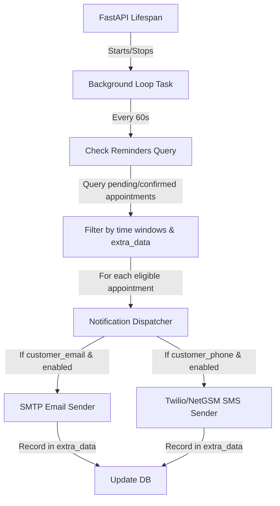

# Spec: Appointment Reminder Design (GÖREV-8)

## Architecture

## Scheduling Logic (Regions)
To ensure no overlapping dispatches or spamming:
- **Region A (1-day)**: `now + 2 hours < appointment_date <= now + 24 hours`. Send if `1d` not in `extra_data["sent_reminders"]`.
- **Region B (1-hour)**: `now + 45 minutes < appointment_date <= now + 2 hours`. Send if `1h` not in `extra_data["sent_reminders"]`.
- **Region C (30-min)**: `now < appointment_date <= now + 45 minutes`. Send if `30m` not in `extra_data["sent_reminders"]`.

## Database Schema & Fields
- Model: `Appointment`
- Fields used:
  - `customer_name`, `customer_email`, `customer_phone`
  - `appointment_date`, `service_type`, `status`
  - `extra_data` (JSONB): track sent dispatches: `{"sent_reminders": ["1d", "1h"]}`
  - `reminder_sent` (Boolean), `reminder_sent_at` (DateTime)

## API / Service Modules

1. **`backend/services/notification_service.py`**:
   - `NotificationService.send_email(...)`
   - `NotificationService.send_sms(...)`
   - Dynamically parses template strings like `Sayın {customer_name}, {appointment_date}...` using Python's `.format()`.
   - Supports Twilio SMS via standard HTTP requests.
   - Supports NetGSM SMS via SOAP/XML/HTTP POST request.
   - Supports SMTP via `smtplib` run inside a threadpool.
   - Falls back to log output if settings are unconfigured.

2. **`backend/services/reminder_scheduler.py`**:
   - `start_reminder_scheduler()`: Main background task loop.
   - `stop_reminder_scheduler(task)`: Gracefully cancel the loop task.
   - `check_and_send_reminders(db)`: Processes appointments in batch, updates `extra_data` and dispatches alerts.
