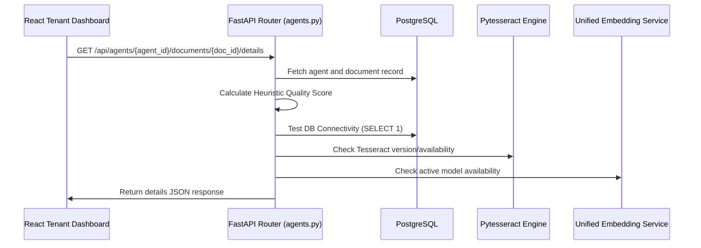

# Spec: Document Monitoring Design (GÖREV-12)

## Architecture & API Design

We introduce an endpoint to fetch processed logs, quality details, and system health status.



## Backend Changes

### 1. Endpoint: `GET /api/agents/{agent_id}/documents/{document_id}/details`
- **Location**: `backend/api/agents.py`
- **Authorization**: Must check if agent belongs to current organization (`get_current_org`) and user.
- **Heuristics Logic**: Implemented in python, returning:
  - `score`: integer (0-100)
  - `tier`: string ("Excellent" | "Good" | "Moderate" | "Low")
  - `suggestions`: list of strings
- **System Health Checks**:
  - `database`: bool
  - `ocr`: bool
  - `embedding`: bool

### Response Payload Structure:
```json
{
  "document_id": 12,
  "name": "manual_v3.pdf",
  "status": "processed",
  "quality": {
    "score": 85,
    "tier": "Mükemmel",
    "suggestions": []
  },
  "logs": [
    {
      "timestamp": "2026-06-03T10:00:00Z",
      "level": "info",
      "stage": "text_extraction",
      "progress": 20,
      "message": "Metin çıkarma başlatıldı."
    }
  ],
  "system_health": {
    "database": true,
    "ocr": true,
    "embedding": true
  }
}
```

## Frontend Dashboard Changes

### 1. API Client (`ragleafApi.ts`)
Add:
```typescript
getDocumentDetails(agentId: number, docId: number): Promise<DocumentDetailsResponse>
```

### 2. Document Details Modal (`TenantDocuments.tsx`)
- Add button next to delete/process on each row: "Detay & Log".
- Clicking opens a premium modal utilizing glassmorphism, harmonious colors, and clean UI spacing.
- Left-side or Top: **Quality gauge** (circular SVG arc with color-coded ring - e.g. green for excellent, yellow for good, red for low). Under the gauge, list recommendations/issues dynamically.
- Right-side or Bottom: **Processing Timeline** showing vertical step indicators (e.g. gray, blue, or green dots depending on success/stage, lines connecting them, timestamps, and log detail messages).
- Footnote: **System Services Status** displaying badge list:
  - `Veritabanı`: Active / Inactive
  - `OCR Servisi`: Active / Inactive
  - `Vektör Motoru`: Active / Inactive
