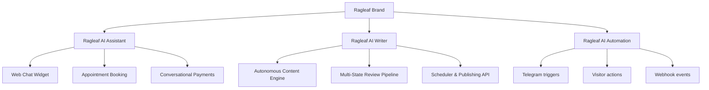
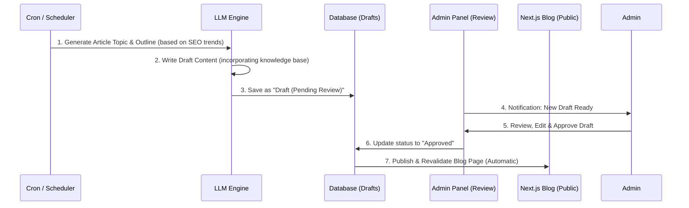

# Ragleaf Future Roadmap & Product Architecture

This document outlines the migration strategy to Next.js (React) and the product definitions for **Ragleaf AI Assistant**, **Ragleaf AI Writer**, and the workflow orchestration suite: **Ragleaf AI Automation**.

---

## 1. Product Taxonomy

### A. Ragleaf AI Assistant (Mevcut Ürün)
*   **Açıklama:** Web sitelerine yerleştirilen, dokümanlarla eğitilen, 7/24 konuşabilen, randevu alabilen ve doğrudan sohbet içinde ödeme toplayabilen interaktif sohbet robotu.
*   **Geliştirme Odağı:** Widget performans iyileştirmeleri, yeni sohbet kanalları (WhatsApp, Telegram) entegrasyonu, ödeme ağ geçitlerinin genişletilmesi.

### B. Ragleaf AI Writer (Mevcut Ürün)
*   **Açıklama:** Asistan kimliği ve ses tonuyla otonom içerik, blog, makale ve sosyal medya gönderileri üreten yapay zeka yazar modülü.
*   **Geliştirme Odağı:** Çok dilli taslak üretimi, insan onaylı yayınlama akışı ve Next.js/WordPress entegrasyonları.

### C. Ragleaf AI Automation (Yeni Ürün)
*   **Açıklama:** Asistanları tetikleyicilerle (Telegram kanalları, web ziyaretçi eylemleri, zamanlama, API webhookları) entegre edip otonom senaryolar kurgulayan otomasyon modülü.
*   **Geliştirme Odağı:** Tetikleyici-eylem eşleme arayüzü, senaryo test simülatörü ve harici entegrasyon kanalları.

---

## 2. Next.js Migration Strategy (Frontend Göçü)

Vanilla HTML/JS altyapısından Next.js App Router yapısına geçiş planı:

1.  **Layouts & Global State:**
    *   `src/app/layout.js` dosyası içinde ortak Header, Footer ve persistent (sayfa geçişlerinde durumunu/geçmişini koruyan) **Ragleaf AI Assistant** bileşeni yer alacaktır.
2.  **Routing:**
    *   Tüm alt sayfalar (`kurulum`, `pricing`, `developers`, `hakkinda`, `contact`, `legal`) `src/app/[page]/page.js` şeklinde Next.js routing yapısına taşınacak.
3.  **Styling:**
    *   Bileşen stillerinin daha temiz yönetilmesi ve performans için **TailwindCSS** kullanılacaktır.
4.  **SEO & Speed:**
    *   Google ve arama motorları için `generateMetadata` fonksiyonları kullanılarak SEO meta etiketleri dinamik yönetilecek.
    *   Sayfalar önceden statik olarak derlenip (SSG - Static Site Generation) Vercel veya Dockerize Nginx üzerinde sunulacak.

---

## 3. Ragleaf AI Writer Blog Otomasyonu İş Akışı

AI Writer'ın arka planda otonom içerik üretmesi için kurgulanan modüler mimari:

### A. İçerik Durumları (Workflow States)
1.  **Draft (Taslak):** AI tarafından yazılmış, ham içerik.
2.  **Pending Review (Onay Bekliyor):** Editör incelemesine hazır içerik.
3.  **Approved (Onaylandı):** Yayınlanmak üzere zamanlanmış veya doğrudan yayına alınabilir içerik.
4.  **Published (Yayınlandı):** Canlı blog sayfasında yayında olan içerik.

### B. Otomasyon Modları
*   **Yarı-Otonom (Önerilen):** Yazılar taslak olarak oluşturulur, admin panelinde editör incelemesinden ve tek tıkla onayından sonra yayına girer.
*   **Tam Otonom:** Belirlenen periyotlarda (örn. haftada 2 kez) AI yazıyı yazar ve editör müdahalesi olmadan doğrudan yayına alır.

---

## 4. Bekleyen Görevler (Pending Tasks)

*   🟡 **Orta Öncelik:** Hazır Sektörler İçin Dosya Şablonları
    *   **Açıklama:** Hazır sektörlere yönelik asistanlar için hazır dosya şablonlarının oluşturulması (ürünler/hizmetler, fiyat listesi, fiyatlandırma vb.).

*   🟢 **Düşük Öncelik:** Blog Otomasyonu & AI Writer Modülü Geliştirmeleri
    *   **Açıklama:** AI Writer taslak içerik üretimi onay mekanizması ve Next.js revalidation yapısının panel tarafındaki admin kontrollerine entegrasyonu.

---

## 5. Arşivlenen / Tamamlanan Görevler (Archived Tasks)

- **Mobil Widget ve Header Buton Tasarımı (2026-06-07):**
  - Mobilde yapay zeka asistan widget açıldığında tüm ekranı kaplaması sağlandı, mobil media query eşiği 768px yapıldı. Sohbet penceresinin z-index'i baloncuğun üstüne çıkarıldı.
  - Masaüstünde header'daki mükerrer "Şimdi Başla" butonu kaldırıldı. "Giriş Yap" butonu ise `btn-primary` ile "Şimdi Başla" butonuyla tamamen aynı tasarım ve hover özelliklerine sahip yapıldı.

- **AIwriter Rebranding & AIautomation (2026-06-06):**
  - AIwriter amacı sadece seo amaçlı yazı blog yazısı yazmak değil; oluşturulmuş bir asistan tarafından her türlü yazı içerik üretilebilir (kimliğe sahip vb.). Her 6 saatte bir otomatik cron ibaresi kaldırıldı.
  - AIautomation adında tetikleyici tabanlı (Telegram mesajı, ziyaretçi gelmesi, özel koşul vb.) yeni bir ürün eklendi. Landing sayfaları ve yönetim paneli (`AIautomation` yeşil vurgulu sidebar ve `Senaryolar` alt sayfası `/tenant/automations/scenarios`) entegre edildi.
  - Affiliate sayfasında örnek referans linki (`ref=*************`) maskelendi ve kopyalama pasifleştirildi. Kazanç hesaplayıcıdan paket indirimi kaldırıldı.

- **Plan Fiyatlandırmaları ve Ürün Yetkilendirmeleri (2026-06-06):**
  - Plan fiyatları güncellendi (Starter: 50$, Pro: 200$, Ultimate: 350$, Ultra: 600$) ve özellik yetkilendirmeleri (AI Assistant/AIchat her planda; AI Writer Ultimate/Ultra planlarında; AI Automation/Senaryolar ise sadece Ultra planında) hem veritabanı plans/organizations tablolarında hem de arayüz yetkilendirme (gating) kontrollerinde yapılandırıldı.

