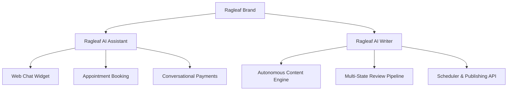
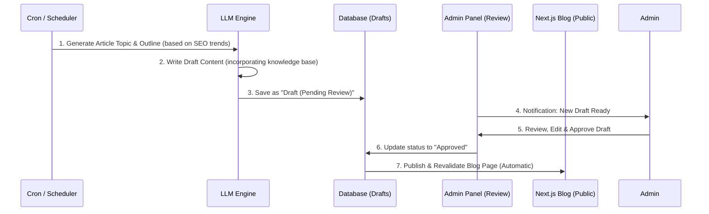

# Ragleaf Future Roadmap & Product Architecture

This document outlines the migration strategy to Next.js (React) and the product definitions for **Ragleaf AI Assistant** and the newly planned autonomous content generation suite: **Ragleaf AI Writer**.

---

## 1. Product Taxonomy

### A. Ragleaf AI Assistant (Mevcut Ürün)
*   **Açıklama:** Web sitelerine yerleştirilen, dokümanlarla eğitilen, 7/24 konuşabilen, randevu alabilen ve doğrudan sohbet içinde ödeme toplayabilen interaktif sohbet robotu.
*   **Geliştirme Odağı:** Widget performans iyileştirmeleri, yeni sohbet kanalları (WhatsApp, Telegram) entegrasyonu, ödeme ağ geçitlerinin genişletilmesi.

### B. Ragleaf AI Writer (Yeni Ürün)
*   **Açıklama:** Sektör trendlerini takip eden, anahtar kelimelere göre SEO uyumlu blog yazıları yazan ve içerik takvimi yöneten yapay zeka yazar ürünü.
*   **Geliştirme Odağı:** LLM entegrasyonlu makale üretici, insan-denetimli (Human-in-the-loop) onay iş akışı, WordPress/Next.js otomatik yayınlama API'leri.

---

## 2. Next.js Migration Strategy (Frontend Göçü)

Vanilla HTML/JS altyapısından Next.js App Router yapısına geçiş planı:

1.  **Layouts & Global State:**
    *   `src/app/layout.js` dosyası içinde ortak Header, Footer ve persistent (sayfa geçişlerinde durumunu/geçmişini koruyan) **Ragleaf AI Assistant** bileşeni yer alacaktır.
2.  **Routing:**
    *   Tüm alt sayfalar (`kurulum`, `pricing`, `developers`, `hakkinda`, `contact`, `legal`) `src/app/[page]/page.js` şeklinde Next.js routing yapısına taşınacak.
3.  **Styling:**
    *   Bileşen stillerinin daha temiz yönetilmesi ve performans için **TailwindCSS** kullanılacaktır.
4.  **SEO & Speed:**
    *   Google ve arama motorları için `generateMetadata` fonksiyonları kullanılarak SEO meta etiketleri dinamik yönetilecek.
    *   Sayfalar önceden statik olarak derlenip (SSG - Static Site Generation) Vercel veya Dockerize Nginx üzerinde sunulacak.

---

## 3. Ragleaf AI Writer Blog Otomasyonu İş Akışı

AI Writer'ın arka planda otonom içerik üretmesi için kurgulanan modüler mimari:

### A. İçerik Durumları (Workflow States)
1.  **Draft (Taslak):** AI tarafından yazılmış, ham içerik.
2.  **Pending Review (Onay Bekliyor):** Editör incelemesine hazır içerik.
3.  **Approved (Onaylandı):** Yayınlanmak üzere zamanlanmış veya doğrudan yayına alınabilir içerik.
4.  **Published (Yayınlandı):** Canlı blog sayfasında yayında olan içerik.

### B. Otomasyon Modları
*   **Yarı-Otonom (Önerilen):** Yazılar taslak olarak oluşturulur, admin panelinde editör incelemesinden ve tek tıkla onayından sonra yayına girer.
*   **Tam Otonom:** Belirlenen periyotlarda (örn. haftada 2 kez) AI yazıyı yazar ve editör müdahalesi olmadan doğrudan yayına alır.

---

## 4. Bekleyen Görevler (Pending Tasks)

## 4. Bekleyen Görevler (Pending Tasks)

*   🔴 **Yüksek Öncelik:** RAG Yönetimi Sidebar ve Sayfası Entegrasyonu
    *   **Açıklama:** Yönetim panelinde RAG ayarlarını ve LLM yapılandırmasını ayrıştırarak daha temiz bir mimari sunma. "Sistem" altındaki genel "AI Yapılandırma" menüsünü kaldırıp, "LLM Yönetimi" altına "LLM Yapılandırması" (/admin/llm-config) ve ayrı bir "RAG Yönetimi" sidebar başlığı oluşturarak "RAG Ayarları" (/admin/rag-config) sayfasını ekleme.
*   🟢 **Düşük Öncelik:** Blog Otomasyonu & AI Writer Modülü Geliştirmeleri
    *   **Açıklama:** AI Writer taslak içerik üretimi onay mekanizması ve Next.js revalidation yapısının panel tarafındaki admin kontrollerine entegrasyonu.

